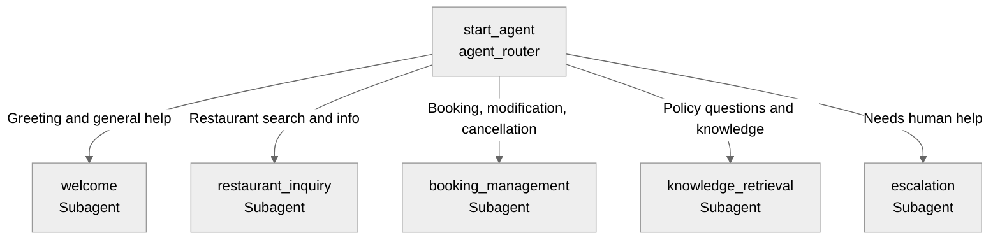

# Agent Spec: Diner_Support_V2

## Purpose & Scope

The Diner Support Agent V2 helps diners find restaurants, manage reservations (create, update, cancel), and get information about restaurant policies and procedures. It operates in the restaurant and hospitality domain.

## Behavioral Intent

- The agent must identify the diner's email or identity before managing reservations.
- It uses Apex actions for all backing logic (CRUD operations on Restaurant/Diner/Reservation objects and Knowledge search).
- It provides proactive restaurant recommendations based on cuisine and location.
- It escalates to a human agent when requested or if complex issues arise.
- Information like `lastConfirmationCode` and `userEmail` persists across subagent switches.

## Subagent Map

## Variables

- `userEmail` (string) — The email address of the current user.
- `lastConfirmationCode` (string) — The confirmation code of the most recently created or updated reservation.
- `lastRestaurantList` (list[string]) — The list of formatted restaurant summaries from the last search.

## Actions & Backing Logic

### get_restaurant_info (restaurant_inquiry subagent)
- **Target:** `apex://AgentAction_GetRestaurantInfo`
- **Backing Status:** EXISTS

### create_reservation (booking_management subagent)
- **Target:** `apex://AgentAction_CreateReservation`
- **Backing Status:** EXISTS

### update_reservation (booking_management subagent)
- **Target:** `apex://AgentAction_UpdateReservation`
- **Backing Status:** EXISTS

### cancel_reservation (booking_management subagent)
- **Target:** `apex://AgentAction_CancelReservation`
- **Backing Status:** EXISTS

### get_reservations (booking_management subagent)
- **Target:** `apex://AgentAction_GetReservations`
- **Backing Status:** EXISTS

### search_knowledge (knowledge_retrieval subagent)
- **Target:** `apex://AgentAction_SearchKnowledge`
- **Backing Status:** EXISTS

### escalate_to_human (escalation subagent)
- **Target:** `apex://AgentAction_EscalateToHuman`
- **Backing Status:** EXISTS

## Gating Logic

- `update_reservation` and `cancel_reservation` are `available when @variables.userEmail != ""` or when a `confirmationCode` is provided.

## Architecture Pattern

Hub-and-spoke. The `agent_router` directs traffic to specialized subagents for inquiries, bookings, and knowledge retrieval.

## Agent Configuration

- **developer_name:** `Diner_Support_V2`
- **agent_label:** `Diner Support Agent V2`
- **agent_type:** `AgentforceServiceAgent`
- **default_agent_user:** `epic.16fa1777910097525@orgfarm.salesforce.com`
