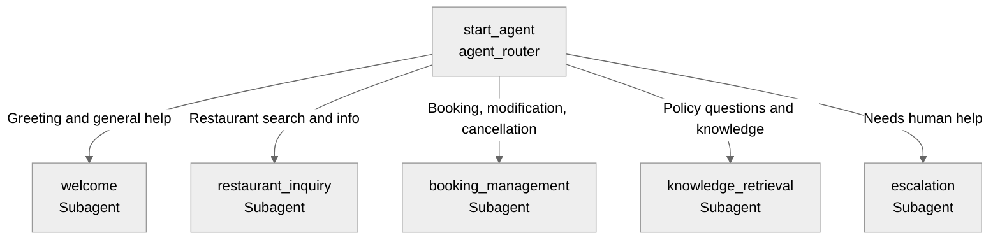

# Agent Spec: Restro_Manager_AI

## Purpose & Scope

The Restro Manager AI helps diners find restaurants, manage reservations (create, update, cancel), and get information about restaurant policies and procedures. It operates in the restaurant and hospitality domain.

## Behavioral Intent

- The agent must identify the diner's email or identity before managing reservations.
- It uses Apex actions for all backing logic (CRUD operations on Restaurant/Diner/Reservation objects and Knowledge search).
- It asks for city and cuisine before searching, then returns restaurant lists with concise details and booking upsell.
- It prioritizes service recovery by acknowledging issues, offering alternatives, and minimizing repeated user effort.
- It escalates to a human agent when requested or if complex issues arise.
- It performs two-step cancellation: capture reason -> pending cancellation -> final cancellation on confirmation.
- It logs closure details to `Agent_Interaction__c` at the end of the conversation.
- Information like `lastConfirmationCode` and `userEmail` persists across subagent switches.

## Subagent Map

## Variables

- `userEmail` (string) — The email address of the current user.
- `lastConfirmationCode` (string) — The confirmation code of the most recently created or updated reservation.
- `preferredCity` (string) — Preferred city for recommendations.
- `preferredCuisine` (string) — Preferred cuisine for recommendations.

## Actions & Backing Logic

### get_restaurant_info (restaurant_inquiry subagent)
- **Target:** `apex://AgentAction_GetRestaurantInfo`
- **Backing Status:** EXISTS

### create_reservation (booking_management subagent)
- **Target:** `apex://AgentAction_CreateReservation`
- **Backing Status:** EXISTS

### update_reservation (booking_management subagent)
- **Target:** `apex://AgentAction_UpdateReservation`
- **Backing Status:** EXISTS

### cancel_reservation (booking_management subagent)
- **Target:** `apex://AgentAction_CancelReservation`
- **Backing Status:** EXISTS

### get_reservations (booking_management subagent)
- **Target:** `apex://AgentAction_GetReservations`
- **Backing Status:** EXISTS

### search_knowledge (knowledge_retrieval subagent)
- **Target:** `apex://AgentAction_SearchKnowledge`
- **Backing Status:** EXISTS

### escalate_to_human (escalation subagent)
- **Target:** `apex://AgentAction_EscalateToHuman`
- **Backing Status:** EXISTS

### close_interaction (conversation_closure subagent)
- **Target:** `apex://AgentAction_CloseInteraction`
- **Backing Status:** EXISTS

## Gating Logic

- `update_reservation` and `cancel_reservation` are `available when @variables.userEmail != ""` or when a `confirmationCode` is provided.
- `get_reservations` expects `userEmail`.
- `create_reservation` expects `restaurantName`, `requestedDateTime`, `partySize`, and `userEmail`.
- `update_reservation` expects `confirmationCode` and optional `newDateTime` / `newPartySize`.
- `cancel_reservation` expects `confirmationCode`, and supports `cancellationReason` + `confirmCancellation` for staged cancellation.
- `get_restaurant_info` expects `city` and `cuisine` (optional `priceRange` and `searchTerm`).
- `get_reservations` can also use `firstName`, `lastName`, and `phone` for diner verification workflows.
- `escalate_to_human` expects `userEmail` with optional `subject`, `conversationSummary`, and `issueType`.

## Architecture Pattern

Hub-and-spoke. The `agent_router` directs traffic to specialized subagents for inquiries, bookings, and knowledge retrieval.
It now includes a `service_recovery` subagent to handle complaints and failed journeys with escalation-ready context.

## Agent Configuration

- **developer_name:** `Restro_Manager_AI`
- **agent_label:** `Restro Manager AI`
- **agent_type:** `AgentforceServiceAgent`
- **default_agent_user:** `epic.16fa1777910097525@orgfarm.salesforce.com`
